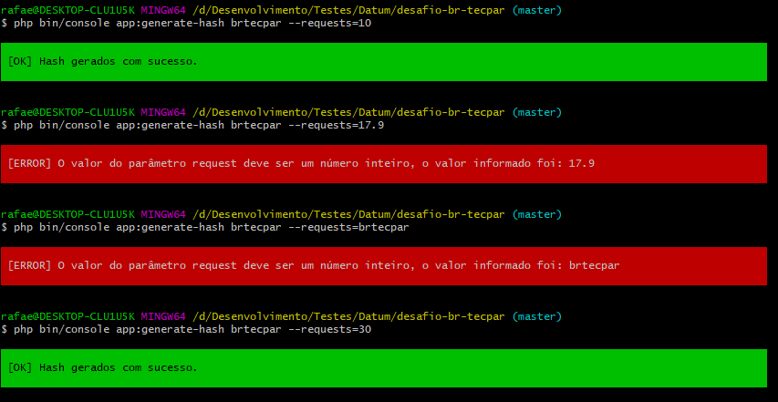
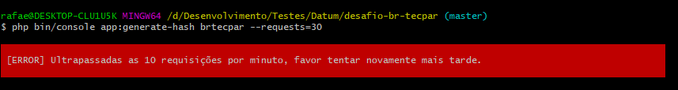
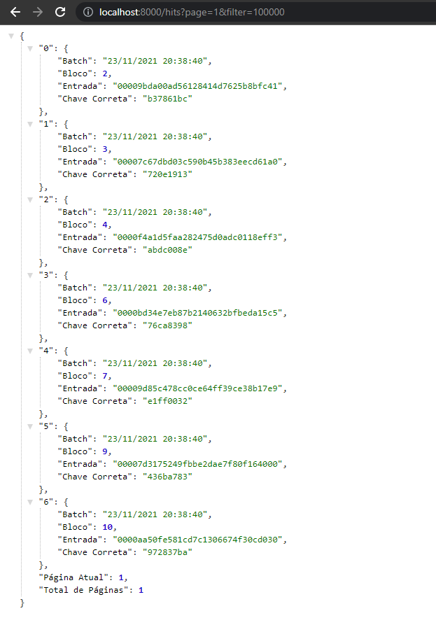
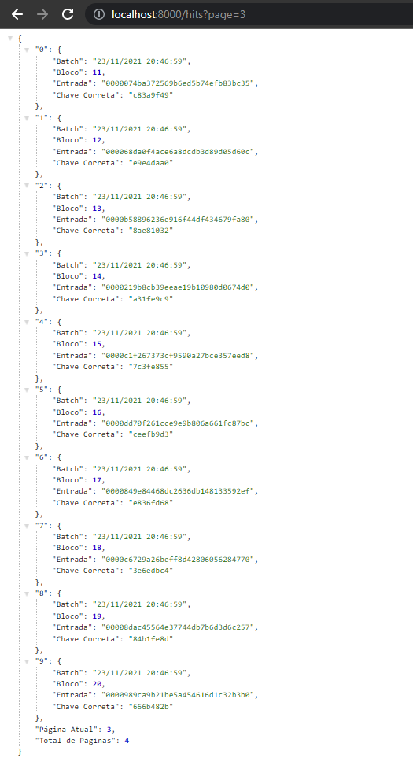

<h1 align="center">Desafio Brasil Tec Par</h1>
<p align="center">Projeto de desafio para Pleno/Senior da Brasil TecPar, com utilização de Symfony 5 e MySQL 5.7</p>

<p align="center">
 * <a href="#about">Sobre</a> * 
 <a href="#install">Instalação</a> *  
 <a href="#how">Como usar</a> * 
</p>

<h4 align="center" id="about"> 
	  Sobre
</h4>
<p align="center">
O desafio se divide em três etapas, 
a criação de uma rota para geração de um hash, que deve ser gerado a partir da 
concatenação de um parâmetro passado pelo usuário e uma string de 8 dígitos 
gerada randomicamente. O hash gerado deve iniciar com '0000' e a rota deve 
permitir o máximo de 10 requisições por minuto por cada IP. 
<br><br>
Na segunda etapa, foi requisitada a criação de um comando para ser executado via 
cli, para executar a rota criada anteriormente, sendo necessários 
dois parâmetros: a string desejada para geração e a quantidade de hashs necessários, sendo que a cada hash gerado, aquele hash se tornava a sstring base do hash. 
Foi solicitada também a gravação dos registros no banco de dados, contendo o horário 
de início de cada requisição, a requisição que representa, a string de entrada, 
a chave encontrada, o hash gerado e o número de tentativas para geração daquele hash.
<br><br>
Na última etapa foi solicitada a criação de uma rota para consulta, filtragem e paginação dos resultados gravados no banco de dados, com alguns campos da entidade sendo retornados somente.
</p>
<h4 align="center" id="install"> 
	  Instalação
</h4>
<p align="center">Você deve garantir que possui o PHP, Composer, Symfony Cli e MySQL instalados em sua máquina.</p>
<p align="center">Verifique no arquivo .env as configurações do banco de dados, como dados de acesso e porta.</p>

```bash
# Clone este repositório
$ git clone <https://github.com/rminossi/desafio-br-tecpar>

# Acesse a pasta do projeto no terminal/cmd
$ cd desafio-br-tecpar

# Instale as dependências
$ composer install

# Execute a aplicação em modo de desenvolvimento
$ symfony serve 
# O servidor inciará na porta:8000

# Execute o comando para criar o banco de dados
$ php bin/console doctrine:database:create

# Execute o comando para executar a migration
$ php bin/console doctrine:migrations:migrate
```

<h4 align="center" id="how"> 
	  Como Usar
</h4>
<p>Para a execução do comando, você deve prosseguir como abaixo.</p>

```bash
# Onde "brtecpar" pode ser substituída por qualquer outra string e o número 10 por qualquer outro inteiro (sujeito a validação como exemplificado abaixo)
$ php bin/console app:generate-hash brtecpar --requests=10
```


<p>Exemplo de execução por mais de 10 requisições por minuto</p>



<p>Para a execução da rota e consulta, você deve prosseguir como abaixo no Insomnia ou no navegador</p>

```bash
# Onde a página é opcional e o filtro de valor máximo também 
http://localhost:8000/hits?page=1&filter=1000
```




